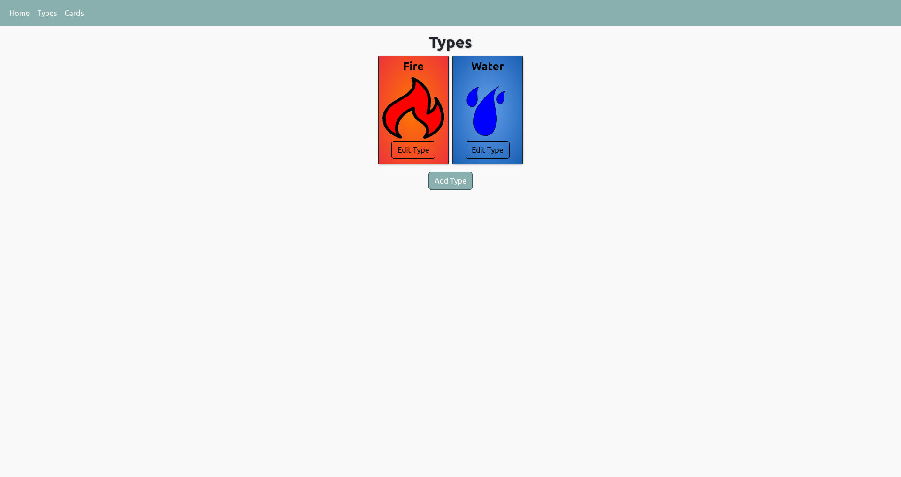
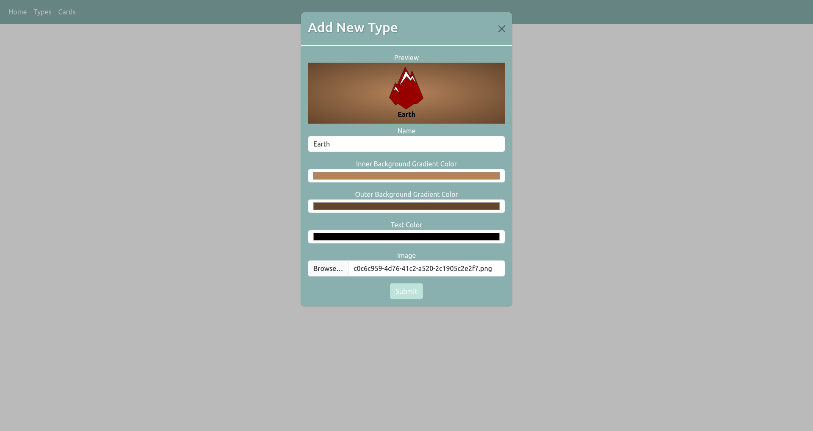
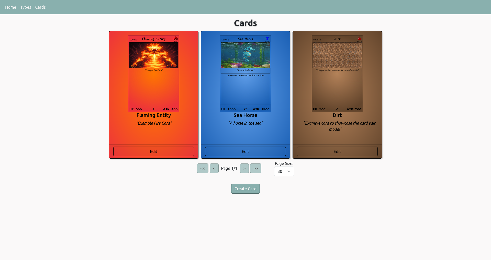
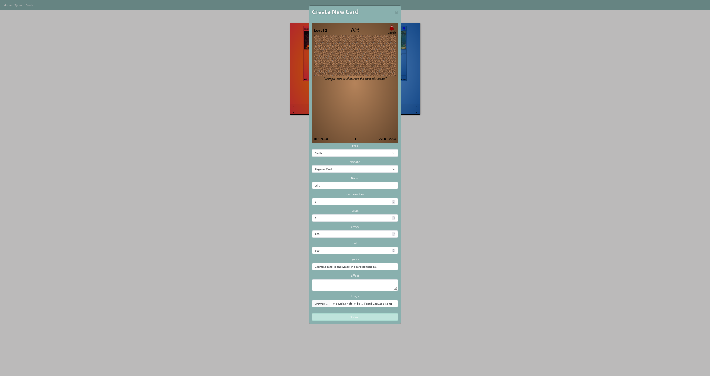

# Card Generator Angular

This project is the frontend for a website that generates images of cards based on user-provided information. Built with Angular and styled using SCSS and Bootstrap, it communicates with an ASP.NET backend (available in a separate GitHub repository) to process data and generate the card images.

## Environment Setup

Environment variables for the application are defined in `environments/environment.ts`. During development, Angular automatically uses `environments/environment.development.ts` as a replacement to provide development-specific settings.

## Card Generation Details

### Card Variants

Cards in this application are categorized as either **regular cards** or **nebula cards**:

- **Regular Cards**: Represent warriors that are placed on the field.
- **Nebula Cards**: Serve as support cards, which can either assist allied warriors or apply negative effects to enemy warriors.

### Card Types

Each card can be assigned a **type**, typically corresponding to an element such as fire, water, or earth. Types help define the card's characteristics and interactions.

Below is a screenshot of the card type management page, where all existing types are listed and new types can be created:



The following screenshot shows the card type creation modal. This interface allows users to upload a representative image for the type, select a background gradient, and choose text colors. These color settings apply only to regular cards, as nebula cards use a predefined color palette.



> **Note:** Assigning a type is mandatory for regular cards but optional for nebula cards.

### Cards

Each card in the application is defined by a set of properties, which vary depending on whether the card is a **regular card** or a **nebula card**. The table below outlines the available properties and their requirements for each card variant:

| Property Name | Description | Regular Card | Nebula Card |
| :-----------: | :---------- | :----------: | :---------: |
| **Name** | The display name of the card | Required | Required |
| **Card Number** | Unique numerical identifier for the card | Required | Required |
| **Card Type** | User-defined type (see [Card Types](#card-types)) | Required | Optional |
| **Level** | Indicates the warrior's power level | Required | Not Applicable |
| **Attack** | Amount of attack damage | Required | Not Applicable |
| **Health** | Amount of health points | Required | Not Applicable |
| **Quote** | A short quote displayed beneath the card image | Optional | Optional |
| **Effect** | Special effect applied during gameplay | Optional | Required |
| **Card Image** | Image displayed at the top of the card | Optional | Optional |

Below is a screenshot of the card management page, which provides a paginated list of all cards and allows users to create new cards:



The following screenshots demonstrate the card creation modal for both regular and nebula cards:



## Development server

To start a local development server, run:

```bash
ng serve
```

Once the server is running, open your browser and navigate to `http://localhost:4200/`. The application will automatically reload whenever you modify any of the source files.

## Code scaffolding

Angular CLI includes powerful code scaffolding tools. To generate a new component, run:

```bash
ng generate component component-name
```

For a complete list of available schematics (such as `components`, `directives`, or `pipes`), run:

```bash
ng generate --help
```

## Building

To build the project run:

```bash
ng build
```

This will compile your project and store the build artifacts in the `dist/` directory. By default, the production build optimizes your application for performance and speed.

## Running unit tests

To execute unit tests with the [Karma](https://karma-runner.github.io) test runner, use the following command:

```bash
ng test
```

## Running end-to-end tests

For end-to-end (e2e) testing, run:

```bash
ng e2e
```

Angular CLI does not come with an end-to-end testing framework by default. You can choose one that suits your needs.

## Additional Resources

For more information on using the Angular CLI, including detailed command references, visit the [Angular CLI Overview and Command Reference](https://angular.dev/tools/cli) page.
